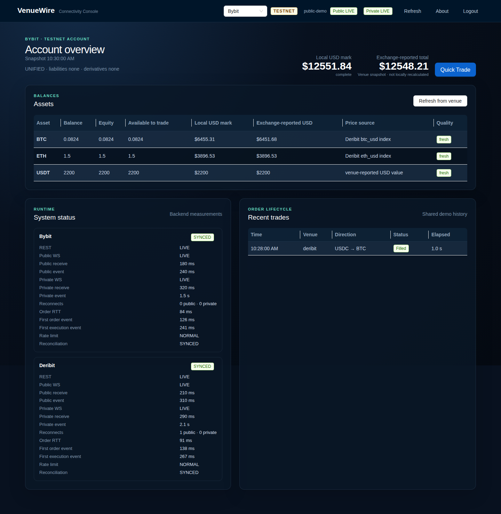
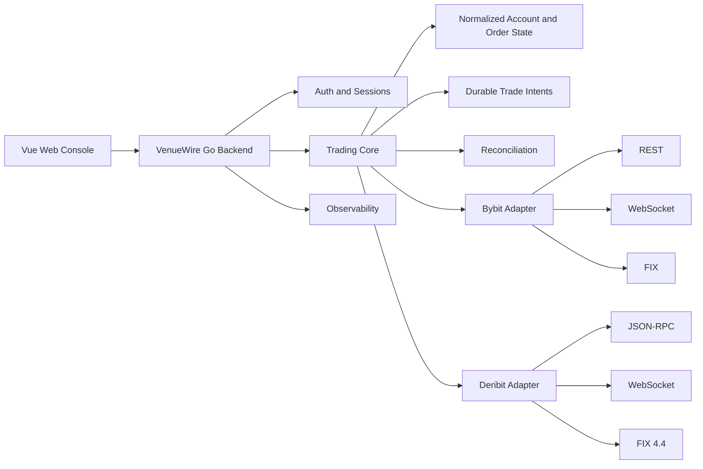

# VenueWire

Multi-Venue Trading Connectivity and Execution Prototype

[](https://github.com/herefindalex/venuewire/actions/workflows/ci.yml)
[](https://github.com/herefindalex/venuewire/actions/workflows/secret-scan.yml)




_Actual VenueWire UI rendered with deterministic sanitized Testnet fixture data; no live account identifiers are shown._

**Bybit and Deribit | REST and JSON-RPC | WebSocket | FIX 4.4**

VenueWire demonstrates multi-venue connectivity, normalized order and account state, durable trade intents, uncertain-outcome recovery, reconciliation, and real-time account observability.

> Testnet only. VenueWire does not support Mainnet, withdrawals, transfers, or real funds.

## Overview

VenueWire is a Go and Vue 3 trading-connectivity prototype built around two independent venue adapters. Its primary interface is an authenticated Web Console, while the CLI exposes engineering and validation workflows for REST, JSON-RPC, WebSocket, FIX, persistence, and reconciliation.

The browser Quick Trade flow supports Bybit BTC/ETH to and from USDT and Deribit BTC to and from USDC. It reviews a short-lived quote, persists an idempotent trade intent, submits a no-borrow Limit IOC order, and tracks the result through exchange events and reconciliation.

## Why this project is interesting

Trading connectivity has failure modes that ordinary CRUD applications can often ignore:

- An order-submission timeout does not mean the exchange rejected the order.
- A connected WebSocket does not mean its data is fresh.
- A REST acknowledgement does not mean an order filled.
- A snapshot and a real-time stream do not automatically form consistent state.

VenueWire focuses on these boundaries through durable trade intents, normalized venue state, idempotency, reconciliation, freshness tracking, and failure isolation.

## Architecture



Trade execution follows a durable identity chain:

```text
Trade Intent
  -> Client Order ID
  -> Venue Order ID
  -> Execution Events
  -> Reconciliation
```

See [Architecture](docs/ARCHITECTURE.md) for component and data-flow details.

## Key engineering problems

- **Uncertain outcomes:** transport failures after submission become `Unknown`; VenueWire reconciles them and never resubmits automatically.
- **State consistency:** snapshots, private streams, public streams, and polling feed revisioned normalized state with stale-data detection.
- **Idempotent execution:** intent, quota reservation, and client identity persist before the first venue write.
- **Venue isolation:** Bybit and Deribit retain their own protocols, units, authentication, rate limits, and FIX dialects.
- **Exact amounts:** order planning and reconciliation use exact decimal arithmetic for quantities, prices, fees, and net proceeds.
- **Failure containment:** one venue can be degraded without converting its failure into a false zero or corrupting the other venue's result.

## Supported venues and protocols

| Capability | Bybit | Deribit |
|---|---|---|
| Environment | Testnet | Testnet |
| Request protocol | REST V5 | HTTP JSON-RPC |
| Public WebSocket | Implemented and Testnet verified | Implemented and Testnet verified |
| Private WebSocket | Implemented and Testnet verified | Implemented and Testnet verified |
| Browser Spot execution | BTC/ETH to and from USDT | BTC to and from USDC |
| FIX 4.4 | Locally tested; live Testnet blocked by external gate | Real Testnet order flow verified |

The evidence and limitations behind each entry are in the [Capability matrix](docs/CAPABILITIES.md).

## Quick demo

Demo access is available on request. The intended interviewer flow is:

1. Sign in to the testnet-only Web Console.
2. Switch between Bybit and Deribit account views.
3. Inspect account values, stream freshness, and System Status.
4. Open Quick Trade and review a protected IOC order.
5. If server-side trading is explicitly enabled, confirm once and follow the durable lifecycle.

`Recheck` queries venue evidence. It does not resubmit or force-resolve an order.

## Safety boundary

- Exact endpoint allowlists reject Mainnet and unexpected redirect targets.
- Browser trading is disabled unless `WEB_TRADING_ENABLED=true`; venue read, trading, and FIX gates remain independent.
- Credentials and session secrets are loaded from process environment or an ignored local dotenv file. They are never sent in browser DTOs.
- Browser orders use fixed liquid Testnet Spot routes, a five-second quote, Limit IOC, 0.5% protection, and no borrowing.
- Accepted intents persist before submission. Duplicate confirmation cannot create a second logical trade.
- Local builds and automated tests use mocks or fixtures and do not place Testnet orders.
- Testnet writes and deployment changes require explicit operator authorization.

See [Security](docs/SECURITY.md) for credential and repository guidance.

## Build and run

Prerequisites are the Go version declared in `go.mod`, Node.js 24, and npm.

```bash
git clone https://github.com/herefindalex/venuewire.git
cd venuewire

cp .env.example .env
# Configure Testnet credentials locally. Keep all write gates disabled initially.

npm --prefix web ci
(cd web && npx playwright install chromium)
make verify
make build

./bin/venuewire --env-file .env web
```

The Go server binds private HTTP behind an HTTPS/WSS Nginx proxy; it does not terminate TLS. See [Deployment](docs/v3/DEPLOYMENT.md) before exposing a demo.

The CLI-only build does not require generated frontend assets:

```bash
make build-cli
./bin/venuewire help
```

## Validation status

Current verified scope is documented in:

- [Current status](docs/STATUS.md)
- [V3 test report](docs/v3/TEST_REPORT_V3.md)
- [Capability matrix](docs/CAPABILITIES.md)

Mock or fixture coverage is never labeled as Testnet verification. Hosted GitHub Actions and repository settings are not considered enabled until observed in GitHub.

## Repository map

| Path | Purpose |
|---|---|
| `cmd/venuewire/` | CLI and Web process composition |
| `internal/` | Venue adapters, domain state, intents, reconciliation, Web API, and observability |
| `web/` | Vue 3 Web Console, unit tests, linting, and browser fixtures |
| `docs/` | Architecture, capability, security, deployment, protocol, and validation evidence |
| `.github/workflows/` | Credential-free CI and secret scanning |
| `Makefile` | Canonical build, formatting, and non-mutating verification entry points |

## Known limitations

- Testnet only.
- No withdrawals or transfers.
- No automatic cross-venue routing or failover.
- No strategy engine or automated trading strategy.
- No HFT performance claim.
- FIX capability differs by venue and validation level.
- Account valuation is not a portfolio-margin or liquidation engine.
- Demo authentication and recent history are shared-instance prototypes, not multi-tenant production controls.
- The host firewall ACL remains an operator verification item even when the public Nginx path passes.

## Documentation

- [Architecture](docs/ARCHITECTURE.md)
- [Capabilities](docs/CAPABILITIES.md)
- [Security](docs/SECURITY.md)
- [Current status](docs/STATUS.md)
- [Browser API](docs/v3/API.md)
- [Protocol notes](docs/v3/PROTOCOL_NOTES.md)
- [Deployment](docs/v3/DEPLOYMENT.md)
- [Demo procedure](docs/v3/DEMO.md)
- [V3 test report](docs/v3/TEST_REPORT_V3.md)
- [Implementation history](IMPLEMENTATION_STATUS.md)
