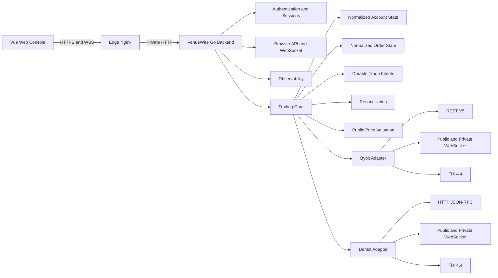
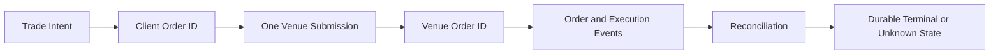

# VenueWire Architecture

VenueWire separates user-facing transport, durable trading state, venue-specific connectivity, and operational observations. The separation matters because exchange acknowledgements and network state do not by themselves establish business outcomes.

## System topology



The browser never connects directly to an exchange. Browser requests read normalized cached state or invoke bounded application operations. Shared exchange streams and refresh managers are owned by the Go process rather than by individual browser sessions.

## Trade identity and recovery



The intent, client identity, quota reservation, and active slot are persisted before the first venue write. A response can establish rejection, acknowledgement, or a transport-uncertain outcome, but VenueWire does not infer a fill from an acknowledgement and does not infer rejection from a timeout.

When the result is uncertain, the intent remains `Unknown`. Startup recovery, private-stream reconnect, periodic recovery, and manual Recheck query independent venue evidence. They never resubmit the original order.

## State consistency

Four distinctions shape the implementation:

```text
HTTP timeout != order failure
Connected != fresh data
ACK != execution
Snapshot + stream != automatically consistent state
```

- Account and order DTOs carry venue identity and monotonic revisions.
- Browser WebSocket envelopes carry a process instance ID and sequence number; gaps trigger resynchronization.
- Receive freshness and meaningful-event freshness are measured separately.
- Older account revisions and late responses from a previously selected venue are rejected.
- Public price marks are maintained independently from exchange-reported balances and never mutate asset quantities.

## Venue isolation

Bybit and Deribit share normalized domain concepts but not transport semantics. Each adapter owns its authentication, endpoints, request schema, amount units, metadata rules, error mapping, and FIX dialect. Cross-venue views preserve partial results and explicit errors rather than fabricating aggregate zeroes.

## Deployment boundary

The supported public topology is Browser HTTPS/WSS to Nginx, then private HTTP to VenueWire. The Go service does not terminate TLS. Host binding, network ACLs, trusted direct-peer validation, forwarded-header replacement, sessions, Origin checks, and CSRF are separate layers; success in one layer is not proof of another.

See [Deployment](v3/DEPLOYMENT.md) for configuration, verification, and rollback procedures.

## Main packages

| Package | Responsibility |
|---|---|
| `cmd/venuewire` | CLI routing, process composition, Web runtime, and stream orchestration |
| `internal/domain` | Venue-qualified identities and normalized order concepts |
| `internal/intent` | Durable intent state, idempotency, quotas, and lifecycle |
| `internal/orderstate` | Persistent normalized order and execution state |
| `internal/accountstate` | Cached account snapshots, valuation, freshness, and metrics |
| `internal/quicktrade` | Protected quote and application-level submission flow |
| `internal/tradereconcile` | Browser trade recovery and terminal-state reconciliation |
| `internal/rest`, `internal/ws`, `internal/fix` | Bybit transports |
| `internal/deribit`, `internal/deribitfix` | Deribit transports and FIX dialect |
| `internal/webconsole` | Authentication, browser REST API, WebSocket, and public DTO boundary |
